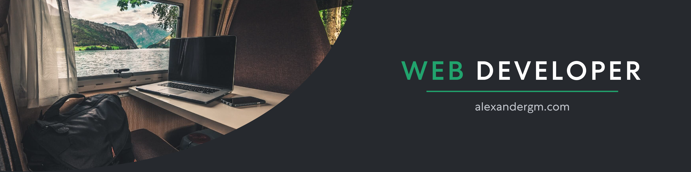

## 🦊 Sobre mi

#   <!--  -->

 
Soy un desarrollador de software amante de la tecnología y el desarrollo web. 👨‍💻 A lo largo de mi trayectoria, he tenido la oportunidad de participar en proyectos de programación y diseño web, colaborando con instituciones reconocidas como la Universidad Pedagógica Nacional y la Escuela Tecnológica Instituto Técnico Central.

Como Licenciado en Diseño Tecnológico, me he formado para potenciar mi capacidad de comunicación de manera efectiva y precisa. 💪   

💻 Licenciado en Diseño Tecnológico en [UPN](https://www.upn.edu.co/) 
📚 Estudiando en [Digital House](https://www.digitalhouse.com/co/) Framework Spring, Microservicios, Clean Code, AWS y JavaScript 

### Mis Tecnologías:          

  <table>
    <tr>
        <td></td>
        <td></td>
    </tr>   
  </table>

